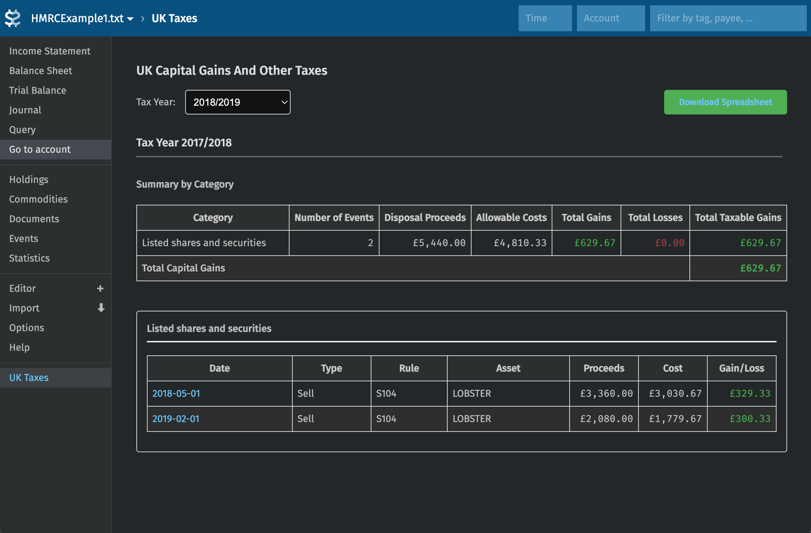
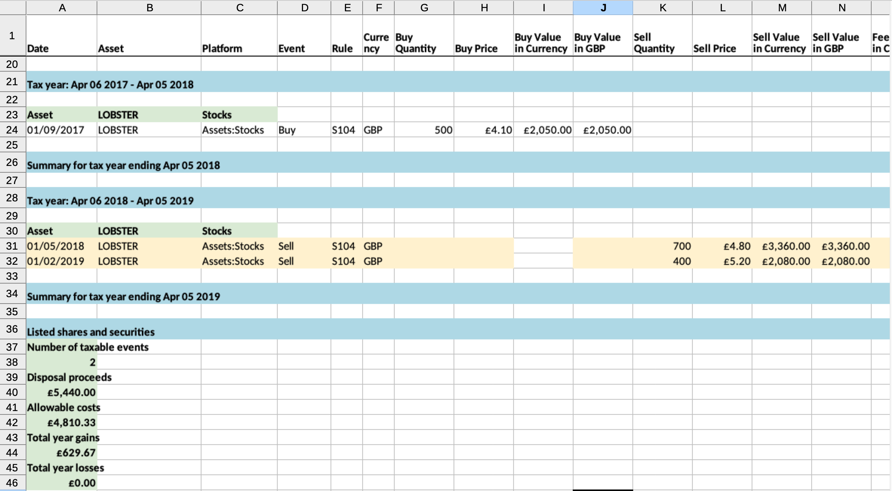

# Beancount Plugin Tax UK

Capital gains and others tax calculator for UK for investments described in [Beancount](https://github.com/beancount/beancount/) format.
Implemented as a plugin for Beancount / Fava that generates United Kingdom tax reports for capital gains, dividends and other investment income, exportable as Excel / xls spreadsheet.

## DISCLAIMER

**This software is provided "as is" without warranty of any kind. The author is neither an accountant nor a finance specialist. Please verify all calculations and consult with a qualified tax professional. This tool is meant to assist with tax calculations but should not be solely relied upon for tax filing purposes.**

## Functionality

This plugin helps calculate UK capital gains tax and generate reports for:

* ✅ Capital gains calculations including handling of Section 104 holding, Bed & Breakfast, and Same Day rules
* ✅ Supporting generic case for various asset types (stocks, crypto, etc.),  platforms, and common event types
* ✅ Dividend income and other investment income
* ✅ Multiple currencies with tax report generated using HMRC or Beancount exchange rates
* ✅ Stock splits
* ✅ Excess reportable income (for accumulation funds)
* ⚠️ Equalisation payments
  > See [tests](https://github.com/Evernight/beancount-plugin-tax-uk/blob/main/tests/README.md) and linked [discussion](https://github.com/mattjgalloway/cgtcalc/issues/15)) for details on possible implementations
* ❌ Showing allowances and actual tax liability (only calculates gains and losses), filing tax return
  > Consult with approrpiate year's official resources and maybe even use licensed software for actually sending out the tax return (after checking your data and possibly consulting with specialist)
* ❌ Any old tax rules, e.g transactions before 6th April 2008
  > Won't be supported

## Available as
* A command-line tool to generate Excel reports
* A Fava plugin for interactive viewing

### Screenshots



## Configuration

### Setup
Install the plugin:
```bash
pip install git+https://github.com/Evernight/beancount-plugin-tax-uk
```
and enable it in the ledger:

```beancount
plugin "beancount_plugin_tax_uk.fava_extension"
```

You'll also need to add some metadata to your transactions to make it work.

### Transaction types

Tag your transactions with the following to mark them for tax processing:

* `#buy` - Asset purchases
* `#sell` - Asset sales
* `#vest` - Share vesting events
* `#stock_split` - Stock splits
* `#dividend` - Dividend income
* `#interest` - Interest income
* `#ERI` - Excess reportable income (for accumulation funds)
* `#rewards_income` - Staking/mining rewards

Only transactions with one of these tags will be considered by the plugin. If you want to tag groups of transactions (e.g. all transactions for a specific account) without manually editing the ledger, I'd recommend using [filter_map](https://github.com/Evernight/beancount-lazy-plugins?tab=readme-ov-file#filter_map) plugin

Example transactions:

```beancount
2023-04-06 * "Buy shares" #buy
  Assets:IBKR:Stocks    10 VWRL {50.00 GBP}
  Assets:IBKR:Cash    -500.00 GBP
  Expenses:Commissions          2.00 GBP

2023-05-01 * "Sell shares" #sell
  Assets:IBKR:Stocks    -5 VWRL {} @ 52.00 GBP
  Assets:IBKR:Cash    260.00 GBP
  Expenses:Commissions          2.00 GBP
```

More examples are available as ```beancount``` files in the [test data folder](tests/data).
You can start Fava with multiple ledgers available via a dropdown selector with:
```
make show-tests
```

### Optional plugin configuration

Plugin is designed to work out of the box without additional configuration when you add the corresponding tags to your transactions. However you may want to adjust its behaviour to adapt it to your Beancount ledger structure and naming conventions.

```beancount
; Map account name to a descriptive shortname of a platform and default asset type
; 2000-01-01 custom "uk-tax-platform-mapping" <pattern> <platform> [<asset_type>]
2000-01-01 custom "uk-tax-platform-mapping" "Assets:SomeBroker:.*" "Broker123" "Stocks"
2000-01-01 custom "uk-tax-platform-mapping" "Assets:SomeCryptoPlatform:.*" "SomeCryptoPlatform" "Crypto"

; Map Beancount commodities to name and asset class used in the report
; 2000-01-01 custom "uk-tax-asset-mapping" <symbol> <mapped name> [<asset_type>]
2000-01-01 custom "uk-tax-asset-mapping" "VWRL" "VG FTSE All-World" "Stocks"
2000-01-01 custom "uk-tax-asset-mapping" "ETH" "Ethereum" "Crypto"

; <asset_type> can be "Stocks" or "Crypto"

; Additional configuration for special account treatment
2000-01-01 custom "uk-tax-config" "commission-account" "^Expenses:.*:Commissions"
2000-01-01 custom "uk-tax-config" "income-account" "^Income:.*"
```

### Using command line 

```bash
python3 -m beancount_plugin_tax_uk.calculate_tax --help
```

If you have currencies in the tax return that are not GBP, the Beancount ```price``` directives will be used by default. If you want to use official HMRC conversion rates, you'll need to download them in special format as in https://github.com/matchilling/hmrc-exchange-rates.

### Plugin configuration

For Fava integration, add the following line to your Beancount file:

```beancount
plugin "beancount_plugin_tax_uk.fava_extension"
```

The ```UK Taxes``` link should appear in the Fava interface.

### Using with Lazy Beancount

[Lazy Beancount](https://github.com/Evernight/lazy-beancount/) contains set of plugins that make keeping track of your investments and other financial operations easier.
This plugin is included in the ```extra``` build on Docker Hub:
```
docker pull vandereer/lazy-beancount:extra
```

## Verification and tests

Obviously, correctness of the results is very much desired. Relevant references to HMRC resources inserted in code where appropriate. Some end-to-end tests are provided taken from various sources.
I found https://github.com/mattjgalloway/cgtcalc to have the most structured test suite, kudos to the author of the tool. Of course, before starting to treat these as a source of truth, refer to the disclaimer and discussions in that repository as well.

Nevertheless, this repository contains a simple parser from ```cgtcalc```'s format into Beancount file, and the test case inputs converted accordingly. To compare outputs with ```cgtcalc```'s expected output you'd have to compare ```xlsx``` reports with ```txt``` files manually, or alternatively run ```show_tests_in_fava.sh``` (```make show-tests```) and compare outputs with reports from ```cgtcalc```.
Note that at this point while some cases are treated identically, there are a few observed differences (that may be fixed in future).

```bash
make test
```

Note differences in the test results mentioned [on the tests README page](tests/README.md).

If you have more test cases to contribute, particularly if the results are verified/confirmed in some way and/or contain some cases not covered by the current tests, please share.

## Other countries

This plugin is designed to work with UK tax rules (even for that case, see the disclaimer above). However, few other countries have similar rules, e.g. in handling capital gains using average cost basis. If you're interested in adapting the plugin, feel free to open an issue, submit a pull request or even fork repository in case implementing these is not generalisable or requires too many changes.

## See also
* 🪙 [Evernight/lazy-beancount](https://github.com/Evernight/lazy-beancount) - Beancount pre-packaged in Docker with plugins, in case you're just starting with Beancount or want to upgrade your experience. Includes this plugin in ```extra``` package.

And other open source capital gains tax calculators for the UK:
* 🧮 [mattjgalloway/cgtcalc](https://github.com/mattjgalloway/cgtcalc) - tax reporting for UK from custom format, written in Swift
* 🧮 [KapJI/capital-gains-calculator](https://github.com/KapJI/capital-gains-calculator) - tax reporting for UK, with few selected platforms supported
* 🧮 [BittyTax/BittyTax](https://github.com/BittyTax/BittyTax) - tax reporting for UK, only for crypto
